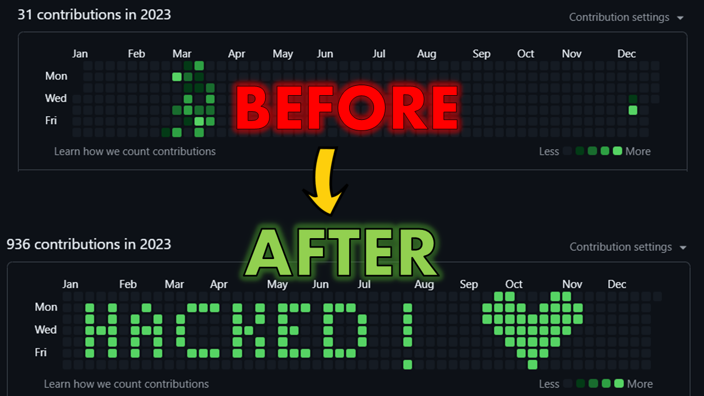
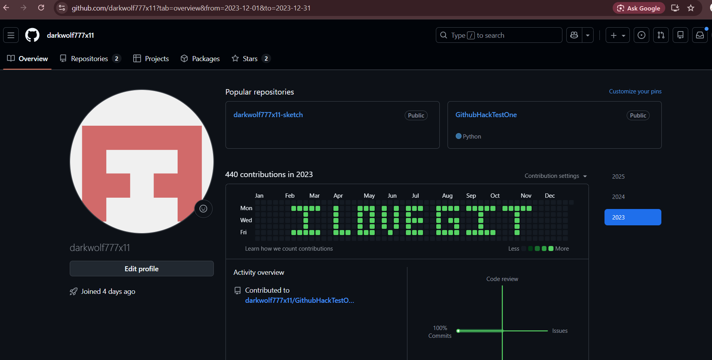
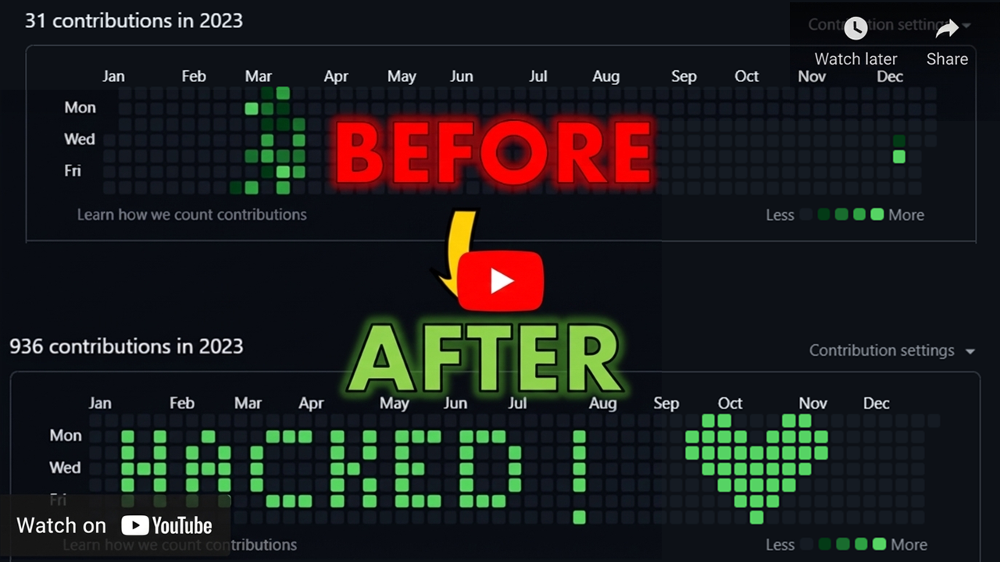

# 🧠 GitHub Commit Lab (Github-Contribution-Graph-Hack)

Create **custom patterns, text, or designs** on your GitHub contribution graph using automated commits.

This project is a **Python-based script** that takes a generated `pattern.json` file and converts it into **real GitHub commits**, making your contribution graph display the desired pattern using green dots.

> 🎯 Built for learning, fun, and open-source experimentation.


## ✨ What Does This Project Do?

#### 🕰️Act as a Time Machine for Your GitHub Graph

Think of this project as a **time machine** 🚀 for your GitHub contribution graph.

We all have moments where:
- We were inactive for months
- Made mistakes
- Forgot to push code
- Or simply didn’t know GitHub well enough

This tool lets you **travel back in time** and visualize patterns on your contribution graph by converting a generated `pattern.json` into **real commits with past dates**.

It doesn’t change who you are —  
it just helps you **experiment, learn, and have fun** with how GitHub graphs work.

> ✨ Wash away old gaps, explore commit history mechanics, and create something visually cool — responsibly.


## 🖼 Example Output
Here’s what a generated pattern looks like on a GitHub profile:




## 🧠 How It Works (Simple Explanation)

GitHub contribution graph is:
- **7 rows** → days of the week  
- **52 columns** → weeks in a year  

This script:
1. Reads your pattern grid  
2. Converts active cells into commit dates  
3. Creates commits using Git  
4. GitHub shows them as green dots  

No fake rendering — **real commits, real graph**.


## 🚀 How To Use


### 1️⃣ Generate `pattern.json`

This script **requires a pattern file**.

You can generate it using my pattern generator website or from my repository:

 🌐 **GitHub Pattern Generator**  
👉 https://github-pattern-generator.web.app/


Steps:
- Open the website  
- Design your text or pattern  
- Download `pattern.json`  
- Place it in this repository by replacing old "pattern.json" 

#### 🖼 Website Generated Pattern Example
Here’s what a generated pattern looks like and remember to download:




## 2️⃣ Create a New GitHub Repository

- Create a **new public repository** on GitHub
- This repository will be used to generate contribution commits
- Prefer using an **empty repo**

Clone it locally:

```bash
git clone <your-new-repo-url>
cd <your-new-repo-name>
```


## 3️⃣ Clone the Tool Repository (Temporary)

Clone the tool repository to get the required script files:

```bash
git clone https://github.com/aurafarmerone/github-contribution-graph-hack.git
```

This repository contains:

* Commit generation script
* Supporting files


## 4️⃣ Move Required Files Into Your Repo

* Copy the required script files from the cloned tool repository
* Paste them into **your new repository directory**
* Ensure the script file is present in the repo root

⚠️ **Important**
After copying files:

* **Delete the cloned tool repository**
* This avoids `.git` conflicts and unexpected errors


## 5️⃣ Replace `pattern.json`

* Delete the existing `pattern.json`
* Paste your downloaded `pattern.json`
* Ensure the filename is exactly:

```text
pattern.json
```


## 6️⃣ Push Initial Setup to GitHub

Before running the script, push the setup:

```bash
git add .
git commit -m "Initial setup for contribution pattern"
git push origin main
```


## 7️⃣ Run the Script

Run the script:

```bash
python script.py
```

When prompted, enter the year:

```text
Enter year to draw pattern: 2023
```

This will:

* Generate real commits
* Assign past dates
* Encode your pattern into the GitHub contribution graph

⏳ Execution time depends on pattern size.


## 8️⃣ View Result on GitHub 🎉

* Open your GitHub profile
* Scroll to **Contribution Graph**
* Your custom pattern will appear as green dots

⏰ GitHub may take a few minutes to update.


## 📺 **Full YouTube Walkthrough** 
### 🎥 Video Tutorial

[](https://youtu.be/OQpGpr-m42s)

👉 Video Link: https://youtu.be/OQpGpr-m42s


## ⚠️ Disclaimer

This project is created **just for fun, learning, and experimentation**.

❗ Please do **NOT**:
- Mislead others using your contribution graph  
- Claim fake activity during interviews  
- Use this for unfair advantages  

Be honest — skills matter more than graphs.


## 🤝 Contributing

Want to improve this project?

Please read **CONTRIBUTING.md** for guidelines on:
- Reporting issues  
- Suggesting features  
- Submitting pull requests  

All contributions are welcome ❤️
 

## 📜 License

This project is licensed under the **MIT License** — feel free to use, modify, and distribute.


## ❤️ Credits

Made with ❤️ by **Aura Farmer**  
If you find this project useful, consider giving it a ⭐ on GitHub!


